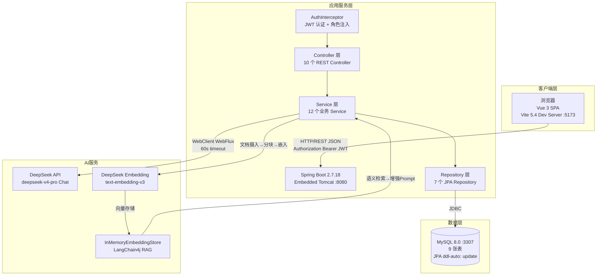
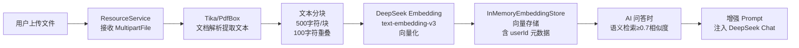
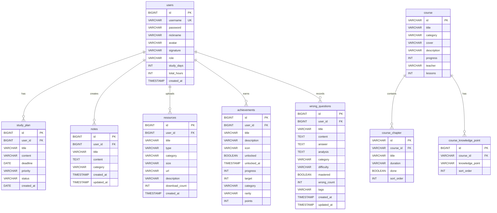

# AI 学习成长助手平台（AI Learning Growth Assistant Platform）

> 基于 **Vue 3.5 + Spring Boot 2.7 + MySQL 8.0 + DeepSeek AI** 的全栈学习管理平台，集成 RAG 检索增强生成、JWT 角色权限、数据分析与成就系统。

---

## 项目简介

AI 学习成长助手平台是面向高校学生的全栈 Web 学习管理工具，前后端分离架构，涵盖学习计划、课程管理、AI 智能问答（DeepSeek + LangChain4j RAG）、笔记管理、错题本、学习资源库、番茄专注、成就系统与数据分析 12 大功能模块，帮助学习者科学规划任务、管理系统知识、获取 AI 个性化指导。

---

## 项目目标

1. **构建全栈学习管理平台**：Spring Boot + Vue 3 前后端分离，覆盖从用户认证到数据分析的完整学习闭环
2. **实现角色权限管理**：基于 JWT + 角色字段（admin/user）的接口级权限控制
3. **接入 AI 大模型**：DeepSeek API（deepseek-v4-pro）+ LangChain4j RAG，实现基于用户知识库的智能问答
4. **数据驱动学习洞察**：ECharts 6.1 多维度可视化（趋势图、分布图、热力图）
5. **工程化开发规范**：RESTful API、MVC 分层、统一响应格式、全局异常处理

---

## 核心功能

| 模块 | 功能点 |
|------|--------|
| 🔐 用户认证 | JWT 登录/注册/退出、路由守卫、localStorage 会话持久化 |
| 📊 首页仪表盘 | 统计卡片、学习趋势图、快捷入口、AI 推荐、每日名言 |
| 📋 学习计划 | CRUD + 状态流转 + 表格/卡片双视图 + 多条件筛选 + 分页 |
| 🍅 番茄专注 | 25 分钟倒计时、任务绑定、阶段切换、浏览器通知、统计复盘 |
| 📚 课程管理 | 卡片网格 + 分类/关键词搜索 + 管理员 CRUD（抽屉详情 + 章节时间轴） |
| 🤖 AI 助手 | DeepSeek 对话 + RAG 知识增强 + 快捷问题 + 回复保存为笔记 |
| 📝 笔记管理 | CRUD + 分类筛选 + 标签 + AI 回复一键转笔记 |
| ❌ 错题本 | CRUD + 难度/状态筛选 + 掌握标记 + 即时状态更新 |
| 📁 学习资源 | 文件上传/下载 + 分类/类型筛选 + PDF/ZIP 图标识别 + 下载计数 |
| 🏆 成就系统 | 8 项成就自动同步 + 稀有度分级 + 进度评估 |
| 📈 数据分析 | 月度趋势/周分布/任务环形图/课程进度/日历热力图 |
| 👤 个人中心 | 资料编辑、学习统计、退出登录 |

---

## 系统架构图



### 数据流说明

**请求链路**：浏览器 → Vite Proxy（`/api` → `:8080`）→ AuthInterceptor（JWT 验证 → AuthContext ThreadLocal）→ Controller → Service → Repository → MySQL

**AI 对话链路**：用户提问 → AiController → AiService → RagService 检索知识库（相似度 ≥ 0.7）→ 构建增强 Prompt → DeepSeek API `/chat/completions` → 解析响应 → 返回答案

---

## 功能模块详解

### 1. 学习资源模块

**功能**：文件上传下载、分类管理、外链资源创建、卡片式展示、PDF/ZIP 图标识别、多条件组合筛选、下载计数

**实现逻辑**：

- **上传流程**：前端 `el-upload`（multipart/form-data）→ `ResourceController.upload()` → `MultipartFile` 接收 → UUID 重命名防冲突 → 存储至 `./uploads/` 目录 → 记录入库（`resources` 表）→ 下载计数初始化为 0
- **文件类型识别**：`ResourceService` 根据文件扩展名自动判定类型（PDF/图片/视频/文档/ZIP），前端卡片渲染对应 Element Plus 图标
- **下载流程**：`GET /api/resource/download/{id}` → `ResourceService` 读取文件流 → `ResponseEntity<Resource>` 返回 → 前端 `axios({ responseType: 'blob' })` → 创建 Blob URL → 触发浏览器下载 → 下载计数 +1
- **RAG 知识库摄入流程**：



- **筛选机制**：前端 `category` + `type` 双维度筛选 + 400ms 防抖关键词搜索，后端 `ResourceService.list()` 使用 Stream API 过滤

### 2. 错题本模块

**功能**：CRUD、多维筛选（分类/难度/状态/关键词）、难度筛选（简单/中等/困难）、标签检索、mastered 状态流转、即时状态更新

**实现方案**：

- **状态设计**：`mastered` 字段（BOOLEAN）+ `difficulty` 字段（VARCHAR，中文值：简单/中等/困难），前端列表左侧彩色边框（红=未掌握，绿=已掌握）
- **状态流转**：新增错题 `mastered=false` → 复习中 → 调用 `POST /api/wrongQuestion/master/{id}` → `mastered=true`
- **StatCard 统计**：`useWrongQuestionStore` 提供 `newCount`、`reviewingCount`、`masteredCount` 计算属性，顶部 StatCard 实时展示
- **即时更新**：Pinia Store 的 `markAsMastered(id)` 方法先调 API，成功后立即更新本地 state 中的 `mastered` 字段，前端响应式同步刷新列表状态色

### 3. 笔记管理模块

**功能**：CRUD、分类管理（学习/思考/计划）、内容截断预览、AI 回复转笔记、自动标题生成、AI 问答知识沉淀

**模块协作流程**：

- **AI 回复转笔记**：用户在 `AiAssistantView` 中点击 AI 回复下方的"保存为笔记"按钮 → `AIChatBox` emit `saveAsNote(message)` → 父组件调用 `useNoteStore.createNote()` → `POST /api/note/create`（自动截取前 50 字符作标题）→ 返回 `ApiResponse<Note>`
- **知识沉淀闭环**：AI 对话 → 保存为笔记 → 笔记作为 RAG 知识源（未来可扩展）→ AI 检索用户笔记内容
- **内容截断预览**：笔记卡片使用 CSS `-webkit-line-clamp: 3` 截断，数据库存完整 `TEXT` 类型内容，编辑时抽屉展开全量

### 4. 学习计划模块

**功能**：创建/编辑/删除、状态流转（待开始→进行中→已完成）、表格/卡片双视图切换、Pinia 即时更新、分页、多条件筛选

**实现逻辑**：

- **状态流转**：`useStudyPlanStore.toggleStatus(plan)` → 循环切换 `pending → in_progress → done → pending` → `PUT /api/study-plan/{id}` → 更新本地 state
- **双视图切换**：`StudyPlanView.vue` 使用 `viewMode` ref 控制，表格模式使用 `el-table` + `el-pagination`，卡片模式使用 `el-card` 网格布局
- **筛选与分页**：前端维护 `query` 对象 `{ page, pageSize, priority, status, keyword }` → 400ms 防抖 → `GET /api/study-plan/list?page=1&pageSize=10&status=in_progress` → 后端 `StudyPlanService` Stream API 过滤 + 内存分页
- **即时更新**：Pinia Store 的 CRUD action 成功后立即修改本地 plans 数组，无需重新请求全量数据

---

## 技术栈

> 以下版本号均从项目实际配置文件（`package.json`、`pom.xml`）中读取。

### 前端

| 技术 | 版本 | 用途 |
|------|------|------|
| Vue | 3.5.34 | 核心框架（Composition API + `<script setup>`） |
| Vite | 5.4.11 | 构建工具与开发服务器（HMR 热更新） |
| Vue Router | 5.0.7 | SPA 路由管理（HTML5 History 模式、懒加载、导航守卫） |
| Pinia | 3.0.4 | 状态管理（8 个 Store，localStorage 持久化） |
| Element Plus | 2.14.0 | UI 组件库（按需引入 + 深色主题） |
| @element-plus/icons-vue | 2.3.2 | Element Plus 图标集 |
| Axios | 1.16.1 | HTTP 请求封装（拦截器、JWT 注入、Loading 管理） |
| ECharts | 6.1.0 | 数据可视化（按需引入 line/bar/pie/heatmap） |
| Sass | 1.100.0 | CSS 预处理器（SCSS 变量 + 混入 + 全局注入） |
| lodash-es | 4.18.1 | 工具函数（debounce 防抖） |

**Vite 插件**：

| 插件 | 版本 | 用途 |
|------|------|------|
| @vitejs/plugin-vue | 5.1.4 | Vue SFC 编译 |
| unplugin-auto-import | 0.18.6 | Vue/Router/Pinia API 自动导入 |
| unplugin-vue-components | 0.27.5 | Element Plus 组件按需导入 |
| vite-plugin-compression | 0.5.1 | Gzip + Brotli 预压缩 |

### 后端

| 技术 | 版本 | 用途 |
|------|------|------|
| Java | 17 (JDK) | 运行环境 |
| Spring Boot | 2.7.18 | 核心框架（Web + WebFlux + Validation + Data JPA） |
| Spring Data JPA | (managed) | ORM 框架（Hibernate 5.6） |
| MySQL | 8.0 | 关系型数据库（端口 3307） |
| mysql-connector-j | (managed) | JDBC 驱动 |
| JJWT | 0.12.6 | JWT Token 签发与验证（HMAC-SHA256） |
| LangChain4j | 0.36.2 | AI 集成框架（LLM + Embedding + RAG） |
| PDFBox | 2.0.30 | PDF 文件解析（RAG 文档摄入） |
| Lombok | (managed) | 简化 POJO 代码 |
| Maven | 3.9 | 项目构建与依赖管理 |

### AI 能力

| 能力 | 实现 | 说明 |
|------|------|------|
| LLM 对话 | DeepSeek API `deepseek-v4-pro` | WebClient 异步调用，60s 超时 |
| RAG 检索增强 | LangChain4j 0.36.2 | 文档解析 → 分块 → Embedding → 语义检索 → Prompt 增强 |
| 向量嵌入 | DeepSeek `text-embedding-v3` | 文本向量化，相似度阈值 0.7 |
| 向量存储 | `InMemoryEmbeddingStore` | 内存向量数据库（演示环境） |
| 文档解析 | Apache Tika + PDFBox | 支持 PDF、TXT 等格式 |

### 开发工具

| 工具 | 用途 |
|------|------|
| IntelliJ IDEA | 后端 Java 开发 |
| VS Code | 前端 Vue 开发 |
| Git + Gitee | 版本控制与代码托管 |
| Postman | API 接口测试 |
| Maven 3.9 | 后端构建 |
| npm | 前端包管理 |
| MySQL Workbench | 数据库管理 |

---

## 项目环境配置

### 运行环境

| 环境项 | 版本/说明 |
|--------|----------|
| JDK | 17 |
| Node.js | ≥ 20.19 |
| npm | ≥ 10.x |
| Maven | ≥ 3.6 |
| MySQL | 8.0 |
| 操作系统 | Windows 11 / macOS / Linux |
| Redis | 未使用（TODO） |

### 环境变量说明

| 配置项 | 位置 | 默认值 | 说明 |
|--------|------|--------|------|
| 数据库地址 | `application.yml` | `localhost:3307` | MySQL 服务地址 |
| 数据库名 | `application.yml` | `ai_learning` | 自动创建 |
| 数据库用户 | `application.yml` | `root` | MySQL 用户名 |
| 数据库密码 | `application.yml` | `123456` | MySQL 密码 |
| JWT 密钥 | `application.yml` | `app.auth.jwt-secret` | JWT 签名密钥 |
| JWT 过期时间 | `application.yml` | 1440 分钟（24h） | Token 有效期 |
| DeepSeek API Key | `application.yml` | `app.deepseek.api-key` | AI 对话 API Key |
| DeepSeek 模型 | `application.yml` | `deepseek-v4-pro` | 对话模型名称 |
| 文件上传目录 | `application.yml` | `./uploads` | 资源文件存储路径 |
| 前端端口 | `vite.config.js` | 5173 | Vite Dev Server |
| 后端端口 | `application.yml` | 8080 | Spring Boot |

### 安装步骤

```bash
# 1. 克隆项目
git clone <your-repo-url>
cd zprojectcode

# 2. 安装前端依赖
npm install

# 3. 安装后端依赖
cd backend
mvn install -DskipTests
cd ..

# 4. 启动 MySQL 8.0（确保端口 3307 可用）
# 5. 修改 backend/src/main/resources/application.yml 中的数据库密码
```

### 启动步骤

```bash
# 终端 1：启动后端（Spring Boot :8080）
cd backend
mvn spring-boot:run

# 终端 2：启动前端（Vite :5173）
npm run dev
```

首次启动后端时：
- JPA `ddl-auto: update` 自动建表
- `DataInitializer` 自动填充演示数据（2 用户、5 课程 52 章节、13 笔记、10 计划、9 错题、10 资源、13 成就）

### 测试方法

```bash
# 1. 浏览器访问 http://localhost:5173
# 2. 使用演示账号登录
#    - 管理员：admin / admin123（可管理课程）
#    - 普通用户：zhangsan / 123456

# 3. API 测试（Postman / curl）
curl http://localhost:8080/api/user/login \
  -H "Content-Type: application/json" \
  -d '{"username":"admin","password":"admin123"}'

# 4. 前端构建测试
npm run build
```

### 构建与部署

```bash
# 前端生产构建
npm run build                    # 输出至 dist/（含 Gzip + Brotli 预压缩）

# 后端打包
cd backend
mvn package -DskipTests          # 输出至 target/backend-1.0.0.jar

# 生产运行
java -jar backend/target/backend-1.0.0.jar
```

---

## 容器化说明

**本项目当前未采用容器化部署。**

项目中未检测到 `Dockerfile` 或 `docker-compose.yml` 文件，所有服务（Vite Dev Server、Spring Boot、MySQL）直接在宿主机运行。

> **后续建议**：可添加 `Dockerfile`（Spring Boot JAR 镜像）+ `docker-compose.yml`（MySQL 8.0 + Spring Boot + Nginx 前端静态文件），实现一键容器化部署。

---

## 项目目录结构

```
zprojectcode/
├── README.md                           # 项目说明文档
├── package.json                        # 前端依赖（Vue 3.5, Vite 5.4, Element Plus 2.14...）
├── vite.config.js                      # Vite 配置（代理/别名/插件/代码分割）
├── 需求文档-AI学习成长助手平台.md        # 需求规格说明书 v2.1
├── 设计文档-AI学习成长助手平台.md        # 系统设计说明书 v2.1
│
├── src/                                # ─── Vue 3 前端源码 ───
│   ├── main.js                         # 入口：创建 App → Pinia/Router/全局指令 → 挂载
│   ├── App.vue                         # 根组件：<router-view> + page-fade 过渡
│   ├── api/                            # Axios 接口封装（10 个模块/45 个端点）
│   │   ├── request.js                  # Axios 实例（baseURL /api, timeout 15s, 拦截器）
│   │   ├── user.js                     # 认证 API（登录/注册/资料/退出）
│   │   ├── course.js                   # 课程 API（含管理员 CRUD）
│   │   ├── studyPlan.js                # 学习计划 API
│   │   ├── note.js                     # 笔记 API
│   │   ├── wrongQuestion.js            # 错题 API
│   │   ├── resource.js                 # 资源 API（上传/下载/CRUD）
│   │   ├── achievement.js              # 成就 API
│   │   ├── ai.js                       # AI 对话 API（timeout 60s）
│   │   ├── analytics.js                # 数据分析 API
│   │   └── dashboard.js                # 仪表盘 API
│   ├── components/
│   │   ├── common/                     # 通用组件（8 个）
│   │   │   ├── AIChatBox.vue           # AI 聊天 UI（消息气泡/typing/快捷问题）
│   │   │   ├── ChartCard.vue           # ECharts 包装器（按需加载/ResizeObserver/主题联动）
│   │   │   ├── CourseCard.vue          # 课程卡片（封面懒加载/进度条/管理员按钮）
│   │   │   ├── LazyImage.vue           # 图片懒加载（IntersectionObserver + shimmer）
│   │   │   ├── ParticleBackground.vue  # Canvas 粒子动画（60 粒子 + 连线）
│   │   │   ├── PomodoroTimer.vue       # 迷你番茄钟（自管理计时器/通知）
│   │   │   ├── QuickEntry.vue          # 快捷入口网格（配置驱动）
│   │   │   └── StatCard.vue            # 统计卡片（渐变数值/图标/插槽）
│   │   └── layout/                     # 布局组件（3 个）
│   │       ├── AppLayout.vue           # 主布局（粒子/侧栏/顶栏/keep-alive/provide）
│   │       ├── AppSidebar.vue          # 侧栏导航（component :is 动态图标）
│   │       └── AppHeader.vue           # 顶栏（折叠/面包屑/主题/粒子开关）
│   ├── directives/
│   │   └── lazy.js                     # v-lazy 全局指令（IntersectionObserver 单例）
│   ├── router/
│   │   ├── index.js                    # 路由实例 + 导航守卫（beforeEach）
│   │   └── routes.js                   # 11 条布局子路由 + getMenuItems()
│   ├── stores/                         # Pinia 状态管理（8 个 Store）
│   │   ├── index.js                    # 统一导出
│   │   ├── user.js                     # 认证状态（token/userInfo/isAdmin/isLoggedIn）
│   │   ├── theme.js                    # 主题配置（isDark/showParticles/sidebarCollapsed）
│   │   ├── studyPlan.js                # 学习计划 CRUD + 筛选 + 状态流转
│   │   ├── pomodoro.js                 # 番茄钟核心（计时/日志/统计计算属性）
│   │   ├── notes.js                    # 笔记 CRUD + 分页筛选
│   │   ├── resource.js                 # 资源上传/下载管理
│   │   ├── achievement.js              # 成就系统（18 项定义 + 进度评估）
│   │   └── wrongQuestion.js            # 错题 CRUD + 掌握标记 + 状态计算
│   ├── styles/
│   │   ├── variables.scss              # SCSS 变量（深色/浅色/品牌色/圆角/阴影）
│   │   ├── mixins.scss                 # SCSS 混入（glass-card/gradient/text-gradient）
│   │   ├── global.scss                 # 全局样式（CSS 自定义属性/重置/动画/响应式）
│   │   └── element-override.scss       # Element Plus 深色/浅色主题覆盖
│   ├── utils/
│   │   ├── storage.js                  # localStorage 封装（try-catch + JSON）
│   │   ├── debounce.js                 # lodash-es debounce 再导出
│   │   ├── persist.js                  # Pinia localStorage 持久化助手
│   │   ├── constants.js                # 业务常量（优先级/状态/快捷入口）
│   │   ├── echarts.js                  # ECharts 图表构建函数（4 种类型 + 双主题）
│   │   ├── echarts-init.js             # ECharts 按需引入入口（~350KB）
│   │   └── index.js                    # 统一导出
│   └── views/                          # 业务页面（12 个）
│       ├── login/LoginView.vue         # 登录/注册（粒子背景 + 品牌展示）
│       ├── dashboard/DashboardView.vue # 仪表盘（统计/名言/推荐/快捷入口）
│       ├── study-plan/StudyPlanView.vue # 学习计划（表格/卡片双视图）
│       ├── pomodoro/PomodoroView.vue   # 番茄专注（计时器 + 统计图表）
│       ├── course/CourseView.vue       # 课程管理（卡片网格 + 管理员 CRUD）
│       ├── ai-assistant/AiAssistantView.vue # AI 助手（DeepSeek + RAG）
│       ├── note/NoteView.vue           # 笔记管理（卡片 + 抽屉编辑器）
│       ├── wrongQuestion/WrongQuestionView.vue # 错题本（彩色状态边框）
│       ├── resource/ResourceView.vue   # 学习资源（上传/下载/筛选）
│       ├── achievement/AchievementView.vue # 成就系统（稀有度网格）
│       ├── analytics/AnalyticsView.vue # 数据分析（4 图表 + 洞察面板）
│       └── profile/ProfileView.vue     # 个人中心（资料编辑 + 统计）
│
├── backend/                            # ─── Spring Boot 后端源码 ───
│   ├── pom.xml                         # Maven 依赖（Spring Boot 2.7.18, JJWT, LangChain4j...）
│   └── src/main/
│       ├── resources/
│       │   ├── application.yml         # 配置（数据库/JWT/DeepSeek/文件上传）
│       │   ├── schema.sql              # 数据库 DDL + 初始数据（共 9 张表）
│       │   └── data.sql                # 初始化确认脚本
│       └── java/com/ailearning/backend/
│           ├── AiLearningBackendApplication.java  # Spring Boot 入口
│           ├── controller/             # REST 控制器（10 个，45 个端点）
│           │   ├── UserController.java           # /api/user（登录/注册/资料/退出）
│           │   ├── CourseController.java         # /api/course ★ 管理员 CRUD
│           │   ├── StudyPlanController.java      # /api/study-plan
│           │   ├── NoteController.java           # /api/note
│           │   ├── WrongQuestionController.java  # /api/wrongQuestion
│           │   ├── ResourceController.java       # /api/resource（上传/下载）
│           │   ├── AchievementController.java    # /api/achievement
│           │   ├── AiController.java             # /api/ai
│           │   ├── AnalyticsController.java      # /api/analytics
│           │   └── DashboardController.java      # /api/dashboard
│           ├── service/                # 业务逻辑（12 个）
│           │   ├── UserService.java              # 登录/注册（明文比对）
│           │   ├── AuthService.java              # JWT 生命周期（签发/验证/黑名单）
│           │   ├── CourseService.java            # 课程 CRUD（管理员鉴权）
│           │   ├── StudyPlanService.java         # 计划 CRUD + 分页 + 统计
│           │   ├── NoteService.java              # 笔记 CRUD + 所有权校验
│           │   ├── WrongQuestionService.java     # 错题 CRUD + 掌握标记
│           │   ├── ResourceService.java          # 资源上传/下载 + RAG 注入
│           │   ├── AchievementService.java       # 成就引擎（8 项 + 评估）
│           │   ├── AiService.java                # DeepSeek LLM 调用（WebClient）
│           │   ├── RagService.java               # RAG 管道（解析→分块→嵌入→检索）
│           │   ├── AnalyticsService.java         # 数据聚合分析
│           │   └── DashboardService.java         # 首页指标聚合
│           ├── entity/                 # JPA 实体（8 个）
│           │   ├── User.java                     # users 表（含 role 字段）
│           │   ├── Course.java                   # course 表（@OneToMany 章节 + @ElementCollection 知识点）
│           │   ├── CourseChapter.java            # course_chapter 表
│           │   ├── Note.java                     # notes 表
│           │   ├── Resource.java                 # resources 表
│           │   ├── StudyPlan.java                # study_plan 表
│           │   ├── Achievement.java              # achievements 表
│           │   └── WrongQuestion.java            # wrong_questions 表
│           ├── repository/             # 数据访问（7 个 JPA Repository）
│           ├── dto/                    # 数据传输对象（5 个）
│           │   ├── LoginRequest.java
│           │   ├── RegisterRequest.java
│           │   ├── ProfileUpdateRequest.java
│           │   ├── CourseRequest.java
│           │   └── StudyPlanRequest.java
│           ├── config/                 # 配置类（4 个）
│           │   ├── WebConfig.java               # CORS + 拦截器注册
│           │   ├── AuthInterceptor.java         # JWT 认证拦截器
│           │   ├── RagConfig.java               # LangChain4j Bean 配置
│           │   └── DataInitializer.java         # 演示数据初始化（幂等）
│           ├── common/                 # 公共模块（2 个）
│           │   ├── ApiResponse.java             # 统一响应 {code, message, data}
│           │   └── AuthContext.java             # ThreadLocal 用户上下文
│           └── exception/              # 异常处理（2 个）
│               ├── ApiException.java            # 业务异常
│               └── GlobalExceptionHandler.java  # @RestControllerAdvice
│
├── docs/                               # 项目文档
│   ├── COMPONENTS.md                   # 组件接口说明（props/emit/slot）
│   └── dev-log/                        # 开发日志（5 篇）
│       ├── dev-log-01.md               # 项目初始化与环境搭建
│       ├── dev-log-02.md               # 学习资源模块 + RAG 流程
│       ├── dev-log-03.md               # 错题本 + 笔记管理
│       ├── dev-log-04.md               # 学习计划 + 状态管理 + 联调
│       └── dev-log-05.md               # 测试优化总结
│
├── uploads/                            # 用户上传文件存储目录
└── node_modules/                       # 前端依赖
```

---

## API 接口说明

**基础地址**：`http://localhost:8080`
**统一响应格式**：`{ "code": 200, "message": "ok", "data": {} }`
**认证方式**：`Authorization: Bearer <jwt_token>`

### 用户认证（UserController）

| 方法 | 路径 | 认证 | 说明 |
|------|------|------|------|
| POST | `/api/user/login` | 否 | 登录 → `{token, userInfo}` |
| POST | `/api/user/register` | 否 | 注册 → `{token, userInfo}` |
| POST | `/api/user/logout` | 是 | 退出（Token 加入黑名单） |
| GET | `/api/user/profile` | 是 | 获取当前用户资料 |
| PUT | `/api/user/profile` | 是 | 更新资料（nickname/signature/avatar） |

### 课程管理（CourseController）★

| 方法 | 路径 | 认证 | 权限 | 说明 |
|------|------|------|------|------|
| GET | `/api/course/list` | 是 | 所有用户 | 列表（?category=&keyword=） |
| GET | `/api/course/{id}` | 是 | 所有用户 | 详情（含章节） |
| POST | `/api/course` | 是 | **仅 admin** | 创建课程 |
| PUT | `/api/course/{id}` | 是 | **仅 admin** | 更新课程 |
| DELETE | `/api/course/{id}` | 是 | **仅 admin** | 删除课程 |

### 学习资源（ResourceController）

| 方法 | 路径 | 认证 | 说明 |
|------|------|------|------|
| GET | `/api/resource/list` | 是 | 列表（?category=&keyword=&type=&page=&pageSize=） |
| GET | `/api/resource/detail/{id}` | 是 | 详情 |
| POST | `/api/resource/upload` | 是 | 上传文件（multipart/form-data） |
| POST | `/api/resource/create` | 是 | 创建外链资源 |
| DELETE | `/api/resource/delete/{id}` | 是 | 删除 |
| GET | `/api/resource/download/{id}` | 是 | 下载（Blob 流）→ 下载计数 +1 |
| GET | `/api/resource/categories` | 是 | 预设分类列表 |

### 笔记（NoteController）

| 方法 | 路径 | 认证 | 说明 |
|------|------|------|------|
| GET | `/api/note/list` | 是 | 列表（?category=&keyword=） |
| GET | `/api/note/detail/{id}` | 是 | 详情 |
| POST | `/api/note/create` | 是 | 创建笔记 |
| PUT | `/api/note/update/{id}` | 是 | 更新笔记 |
| DELETE | `/api/note/delete/{id}` | 是 | 删除笔记 |
| GET | `/api/note/categories` | 是 | 预设分类（study/thought/plan） |

### 错题本（WrongQuestionController）

| 方法 | 路径 | 认证 | 说明 |
|------|------|------|------|
| GET | `/api/wrongQuestion/list` | 是 | 列表（?category=&keyword=&difficulty=&status=&page=&pageSize=） |
| GET | `/api/wrongQuestion/detail/{id}` | 是 | 详情 |
| POST | `/api/wrongQuestion/create` | 是 | 创建错题 |
| PUT | `/api/wrongQuestion/update/{id}` | 是 | 更新错题 |
| DELETE | `/api/wrongQuestion/delete/{id}` | 是 | 删除错题 |
| POST | `/api/wrongQuestion/master/{id}` | 是 | 标记已掌握 |
| GET | `/api/wrongQuestion/categories` | 是 | 预设分类（数学/英语/计算机） |

### 学习计划（StudyPlanController）

| 方法 | 路径 | 认证 | 说明 |
|------|------|------|------|
| GET | `/api/study-plan/list` | 是 | 分页列表（?page=&pageSize=&priority=&status=&keyword=） |
| POST | `/api/study-plan` | 是 | 创建计划 |
| PUT | `/api/study-plan/{id}` | 是 | 更新计划 |
| DELETE | `/api/study-plan/{id}` | 是 | 删除计划 |

### AI 助手（AiController）

| 方法 | 路径 | 认证 | 说明 |
|------|------|------|------|
| POST | `/api/ai/chat` | 是 | AI 对话（含 RAG 增强，60s 超时） |
| GET | `/api/ai/quick-questions` | 是 | 快捷问题列表 |

### 成就系统 / 数据分析 / 仪表盘

| 方法 | 路径 | 说明 |
|------|------|------|
| GET | `/api/achievement/list` | 用户成就列表 |
| GET | `/api/achievement/stats` | 成就统计 |
| POST | `/api/achievement/init` | 初始化/重置成就 |
| GET | `/api/analytics/overview` | 数据总览 |
| GET | `/api/analytics/dashboard` | 仪表盘面板（?range=week/month/quarter） |
| GET | `/api/analytics/tasks` | 任务分布统计 |
| GET | `/api/dashboard/stats` | 首页关键指标 |

> 系统共 **10 个 Controller，45 个 API 端点**。完整接口清单见设计文档。

---

## 数据库设计

### ER 图



### 表清单

| 表名 | 实体 | 记录数（演示数据） | 说明 |
|------|------|------------------|------|
| `users` | User | 2 | 用户（admin + zhangsan） |
| `course` | Course | 5 | 课程（含 52 章节） |
| `course_chapter` | CourseChapter | 52 | 课程章节（@OneToMany） |
| `course_knowledge_point` | @ElementCollection | 40 | 课程知识点 |
| `study_plan` | StudyPlan | 10 | 学习计划 |
| `notes` | Note | 13 | 笔记 |
| `resources` | Resource | 10 | 学习资源 |
| `achievements` | Achievement | 13 | 成就记录 |
| `wrong_questions` | WrongQuestion | 9 | 错题 |

---

## 个人贡献

> 以下分别以第一人称描述本项目中两人的主要工作。两人共同完成了项目整体架构设计，而后各自负责若干模块的前后端全链路开发。

### 何宇轩同学

主要负责以下四个模块的前后端全链路开发：

**① 学习资源模块前后端实现**

从需求分析入手，设计了资源上传/下载、分类管理、外链创建三大功能路径。后端使用 Spring Boot `MultipartFile` 接收文件，UUID 重命名防止冲突，扩展名自动识别类型（PDF/图片/视频/ZIP）；前端封装 `FormData` + `el-upload` 组件实现拖拽上传，下载使用 Blob URL 触发浏览器原生下载。关键设计包括下载计数的并发安全处理、上传文件自动注入 RAG 知识库的管道集成、以及筛选查询的分页与防抖优化。

**② 错题本模块开发**

设计了 "未掌握 → 复习中 → 已掌握" 的状态流转模型，后端 `mastered` 字段 + `POST /master/{id}` 端点实现状态切换。前端使用计算属性实时统计 `newCount`/`reviewingCount`/`masteredCount`，列表渲染时根据 mastered 状态动态切换左侧彩色边框。多维筛选（分类 + 难度 + 状态 + 关键词）通过 Pinia Store 的 query 对象统一管理。

**③ 笔记管理模块开发**

实现了完整的笔记 CRUD 和分类筛选功能。重点攻关了 AI 回复保存为笔记的跨模块协作：`AIChatBox` 通过 emit 将消息传递给父组件 → 调用 `useNoteStore.createNote()` → 自动截取前 50 字符生成标题 → `POST /api/note/create`。笔记内容使用 MySQL TEXT 类型存储，前端卡片使用 CSS 多行截断预览，编辑时抽屉展开全量内容。

**④ 学习计划模块开发**

实现了计划 CRUD + 状态流转（待开始↔进行中↔已完成）+ 表格/卡片双视图切换。后端 `StudyPlanService` 使用 Stream API 实现内存级别的多条件过滤和分页。前端使用 Pinia Store 管理 plans 数组，CRUD action 调用 API 成功后直接修改本地 state，避免额外全量请求，提升交互响应速度。

---

### 邓嘉俊同学

主要负责项目架构搭建、前端基础设施体系建设以及用户认证、首页仪表盘、番茄专注、课程管理、AI助手、成就系统、数据分析和个人中心八个功能模块的前后端全链路开发。

**① 项目架构与基础设施**

主导了Vite + Spring Boot工程初始化与全栈架构搭建。后端设计了Controller → Service → Repository三层体系，定义了`ApiResponse<T>`统一响应格式和`GlobalExceptionHandler`全局异常处理。实现了JWT认证与角色权限全链路：`AuthService`负责Token签发/验证/吊销，`AuthInterceptor`统一拦截注入`AuthContext` ThreadLocal，`requireAdmin()`实现管理员鉴权，Service层通过`getCurrentUserId()`做数据隔离。编写了`DataInitializer`幂等初始化全部演示数据（2用户、5课程52章节、13笔记、10计划、9错题、10资源、13成就）。前端搭建了Vue 3.5 + Vite 5.4工程体系：路由懒加载、Axios统一拦截器（JWT注入/Loading管理/401处理）、三层主题架构（SCSS变量 + CSS自定义属性 + Element Plus覆盖）、8个通用组件及`v-lazy`懒加载指令。

**② 用户认证与仪表盘模块**

登录/注册前端采用双标签切换 + 粒子动画背景，表单预填演示账号，登录后Token和用户信息写入`useUserStore`并持久化localStorage，`router.beforeEach`实现未登录重定向和登录后回跳。后端登录统一错误提示防账号枚举，注册自动生成DiceBear头像。仪表盘模块后端聚合学习天数、任务完成率、周趋势和热力图数据，前端并行拉取6个API整合为欢迎区、AI推荐、快捷入口和多维数据概览面板。

**③ 番茄专注模块**

核心计时引擎基于`Date.now()`差值精确计时，`visibilitychange`事件实现后台恢复校准。设计了专注→短休→长休三阶段自动流转状态机（每4轮触发长休），计时完成通过Notification API通知。实现了复盘与知识沉淀闭环：完成弹窗支持评分和内容记录，可沉淀到笔记或加入错题本。统计分析含6项指标卡片 + 3个ECharts图表（周趋势/高峰时段/课程分布）。

**④ 课程管理与AI助手模块**

课程模块后端`CourseController`区分权限——GET对全部用户开放（支持category + keyword筛选，详情含`@OneToMany`章节 + `@ElementCollection`知识点），POST/PUT/DELETE需管理员鉴权。前端`CourseCard`网格展示 + `el-drawer`详情（`el-timeline`章节轴 + `el-tag`知识点标签）+ `el-dialog`管理表单。AI助手模块使用Spring WebClient调用DeepSeek API（60s超时，thinking推理模式），`RagService`实现RAG三阶段管道：文档摄取（PDFBox/Tika解析→500字分块→text-embedding-v3向量化→InMemoryEmbeddingStore）→语义检索（相似度≥0.7 + userId隔离）→Prompt增强。文件上传自动触发RAG摄入，打通"上传→向量化→AI检索"闭环。前端`AIChatBox`渲染对话，支持5类快捷问题和AI回复一键保存笔记。

**⑤ 成就系统、数据分析与个人中心**

成就模块后端`AchievementService`管理8项预设成就（5级稀有度），`syncAchievements()`引擎每次查询时自动从各业务模块拉取实际数据比对目标值，仅变更时持久化，"传奇学者"需其他7项全解锁自动触发。前端展示环形进度 + 稀有度着色网格 + 双维筛选。数据分析模块后端以userId种子生成确定性模拟数据（月趋势/周分布/任务比例/课程进度/热力图），前端使用StatCard + ECharts多图表（按需引入约350KB），`ChartCard`封装ResizeObserver自适应和双主题联动。个人中心实现了资料编辑（头像实时预览）、统计卡片和笔记列表。

---

通过以上模块的开发实践，本人深入掌握了Spring Boot分层架构与JWT权限设计、Vue 3组件化与Pinia状态管理、DeepSeek API + LangChain4j RAG全管道实现、ECharts数据可视化与双主题联动、复杂状态机设计（番茄钟/成就引擎），以及Vite构建优化和跨模块数据链路设计等全栈工程化能力。

---

## 项目亮点

1. **AI + RAG 知识增强**：集成 DeepSeek API（deepseek-v4-pro）+ LangChain4j 0.36.2 RAG 管道（文档解析→500 字分块→DeepSeek Embedding→语义检索→Prompt 增强），实现基于用户上传资源的个性化 AI 问答
2. **管理员角色权限系统**：JWT Claims 携带 role → AuthInterceptor 注入 ThreadLocal → `AuthContext.requireAdmin()` 方法级鉴权 → 课程 CRUD 受保护，非管理员返回 403
3. **深色/浅色双主题**：CSS 变量 + Element Plus dark class + ECharts 图表联动 + Canvas 粒子背景开关，所有组件完美适配双主题
4. **组件化架构**：11 个通用/布局组件（StatCard/ChartCard/CourseCard/AIChatBox/LazyImage/ParticleBackground/PomodoroTimer/QuickEntry + 3 布局组件），覆盖 props/emit/slot/provide-inject/keep-alive/自定义指令等 Vue 核心考核点
5. **工程化优化**：路由懒加载 + ECharts 按需引入（~350KB vs 1MB）+ Gzip/Brotli 双预压缩 + Vite 代码分割（echarts/element-plus/vue-vendor 独立 chunk）+ 400ms 搜索防抖
6. **完整演示数据体系**：`DataInitializer` 幂等初始化 2 用户 + 5 课程 52 章节 + 13 笔记 + 10 计划 + 9 错题 + 10 资源 + 13 成就，覆盖全模块功能演示
7. **Axios 统一拦截器**：请求自动注入 JWT + 引用计数 Loading + 401 自动登出 + silent 模式 + 业务错误统一 ElMessage 提示
8. **番茄钟精确计时**：基于 `Date.now()` 的差值计算，支持后台标签页恢复校准，浏览器 Notification API 通知 + ElMessage 兜底

---

## 遇到的问题与解决方案

### 1. Pinia Store 在 Axios 拦截器中使用报错

**问题**：在 `request.js` 的响应拦截器中直接 import 调用 `useUserStore()`，报错 `getActivePinia was called with no active Pinia`。

**解决**：Pinia Store 必须在 Pinia 实例安装后才能调用。解决方案是在拦截器内通过动态引入的方式获取 Store 实例：`const userStore = useUserStore()` 放在函数体内而非模块顶层。

### 2. MySQL 8.x 认证插件兼容性

**问题**：MySQL 8.0 默认使用 `caching_sha2_password` 认证插件，导致旧版客户端或某些工具连接失败。

**解决**：使用 `mysql-connector-j`（JDBC 驱动自动处理认证）并确保连接 URL 包含 `serverTimezone=Asia/Shanghai` 参数。必要时可执行 `ALTER USER` 切换回 `mysql_native_password`。

### 3. Spring Boot CORS 配置冲突

**问题**：配置了 `WebMvcConfigurer.addCorsMappings()` 后跨域请求仍然被拦截。

**解决**：`allowedOrigins("*")` 与 `allowCredentials(true)` 不能同时使用。改为 `allowedOriginPatterns("*")` 即可在开发环境支持凭证跨域。同时确保拦截器 preHandle 中对 OPTIONS 预检请求直接放行。

### 4. Vue3 ref 对象在 JS 中未自动解包

**问题**：在 `<script setup>` 外或工具函数中访问 `ref` 对象时，忘记使用 `.value`，导致拿到的是 `RefImpl` 对象而非实际值。

**解决**：Vue 3 的 `ref` 在 template 中自动解包，但在 JS/TS 代码中必须通过 `.value` 访问。对于复杂逻辑，使用 `unref()` 工具函数可兼容处理 ref 和普通值。

### 5. Element Plus 深色主题与自定义样式冲突

**问题**：开启 Element Plus 的 `dark` class 后，自定义的 SCSS 变量未同步切换，导致部分组件颜色异常。

**解决**：采用三层主题架构——SCSS 变量定义 + `:root[data-theme='light']` CSS 自定义属性覆盖 + `element-override.scss` 中 Element Plus CSS 变量覆盖。`useThemeStore.applyTheme()` 同步切换 `html.dark` class 和 `data-theme` 属性。

### 6. RAG 知识库重启丢失

**问题**：`InMemoryEmbeddingStore` 存储的知识向量在服务重启后全部丢失，用户需重新上传文件才能使用 RAG。

**解决**：当前演示环境使用内存存储，已记录为已知限制。生产环境方案：替换为持久化向量数据库（如 Chroma/Pinecone/Milvus），并在 `RagConfig` 中切换 `EmbeddingStore` Bean 实现。

---

## 后续优化方向

1. **密码加密**：引入 Spring Security + BCryptPasswordEncoder 替换明文密码存储，增强安全性
2. **持久化向量数据库**：将 `InMemoryEmbeddingStore` 替换为 Chroma 或 Milvus，解决重启后知识库丢失问题
3. **容器化部署**：编写 `Dockerfile` + `docker-compose.yml`（MySQL + Spring Boot + Nginx），实现一键部署
4. **API 文档自动化**：集成 Swagger/OpenAPI 3.0（SpringDoc），自动生成 API 文档页面
5. **单元测试与集成测试**：前端补充 Vitest 组件测试，后端补充 JUnit + MockMvc 接口测试
6. **真实数据埋点**：接入埋点 SDK（如 Clarity/百度统计）替换当前模拟的趋势/热力图数据
7. **富文本编辑器**：笔记模块引入 Tiptap/Quill 富文本编辑器，替代当前纯文本输入
8. **OAuth2.0 第三方登录**：接入 GitHub/Google 登录，降低注册门槛
9. **移动端适配**：完善 768px 以下响应式布局，或使用 PWA 技术提供类原生体验
10. **消息通知系统**：学习计划到期提醒、成就解锁推送、番茄钟完成通知的持久化与离线推送

---

## 项目阶段

| 阶段 | 内容 | 状态 |
|------|------|------|
| 阶段一 | Vite + Spring Boot 工程初始化 | ✅ |
| 阶段二 | 布局/主题/Pinia/Axios 基础设施 | ✅ |
| 阶段三 | 12 个业务页面开发 | ✅ |
| 阶段四 | Spring Boot + MySQL + JWT 后端 | ✅ |
| 阶段五 | 前后端联调与异常处理 | ✅ |
| 阶段六 | DeepSeek AI + RAG + 角色系统 + 课程 CRUD | ✅ |
| 阶段七 | UI/UX 全面升级（深色主题/毛玻璃/粒子动画） | ✅ |
| 阶段八 | 性能优化（路由懒加载/按需引入/代码分割/预压缩） | ✅ |
| 阶段九 | 文档完善（需求/设计/组件/开发日志） | ✅ |

---

## 演示账号

| 用户名 | 密码 | 角色 | 说明 |
|--------|------|------|------|
| `admin` | `admin123` | **管理员** | 可管理课程（增删改） |
| `zhangsan` | `123456` | 普通用户 | 个人学习管理 |

---

## 许可证

本项目为《信息系统综合实训》课程项目，仅供学习与展示使用。

---

> **文档编制说明**：本 README 基于实际项目代码编写（前端 `package.json`、后端 `pom.xml`、`application.yml`、`vite.config.js`、`DataInitializer.java` 等），所有版本号、数据量、API 端点均与代码一致。
